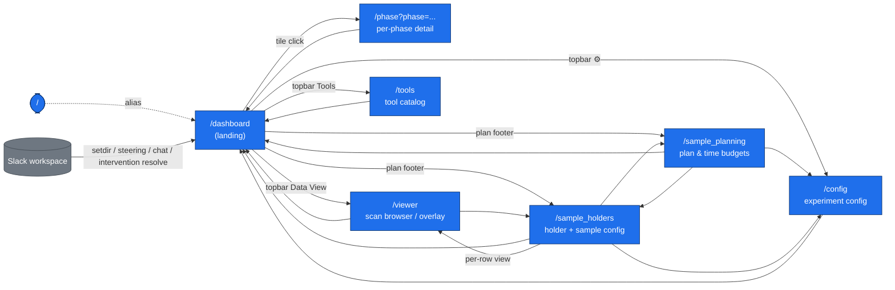

# UI page & API dependency graph

Generated by walking `ui/server/app.py`, every router in `ui/server/routers/`,
and every static page in `ui/static/`. Update this file whenever you add a new
HTML page route or a new router.

## TL;DR — all top-level page endpoints

| URL              | File                                  | How you reach it                                                                                  |
| ---------------- | ------------------------------------- | ------------------------------------------------------------------------------------------------- |
| `/`              | `dashboard/index.html` (alias)        | Default landing                                                                                   |
| `/dashboard`     | `dashboard/index.html`                | Topbar "Dashboard" link from every other page                                                     |
| `/phase`         | `dashboard/phase.html`                | Click any phase tile on the dashboard (`openPhaseDetail()` in `autonomy.js`)                      |
| `/config`        | `config/index.html`                   | Topbar `⚙` from dashboard / sample_planning / sample_holders                                      |
| `/sample_planning` | `sample_planning/index.html`        | Dashboard plan-footer link, sample_holders topbar link                                            |
| `/sample_holders` | `sample_holders/index.html`          | Dashboard plan-footer link, sample_planning topbar link, viewer topbar link                       |
| `/viewer`        | `viewer/index.html`                   | Dashboard topbar "Data View" link, per-row "view" action in `sample_holders.js`                   |
| `/tools`         | `tools/index.html`                    | Dashboard topbar "Tools" (opens in new tab)                                                       |

> **Note on aliases:** `/` and `/dashboard` both serve `dashboard/index.html`.
> If `BASE_PATH` is set (deployment behind a prefix), every route above is
> served under that prefix.

## Navigation graph

## API routers — surface & owner

Every router is included in `ui/server/app.py:create_app`. Pages drive these
endpoints over `fetch()`; nothing else should be calling them directly.

| Prefix                  | File                              | Primary consumer page(s)                       |
| ----------------------- | --------------------------------- | ---------------------------------------------- |
| `/api/agents`           | `agents_api.py`                   | dashboard (agent panel)                         |
| `/api`                  | `config_api.py`                   | config, sample_holders (defaults + submit)      |
| `/api/dashboard`        | `dashboard_api.py`                | dashboard, phase                                |
| `/api/orchestrator`     | `orchestrator_api.py`             | dashboard (status, guidance, intervention)      |
| `/api/phase`            | `phase_runner_api.py`             | dashboard tiles, phase detail                   |
| `/api/plan`             | `plan_api.py`                     | dashboard plan table, sample_planning           |
| `/api/safety_switches`  | `safety_switches_api.py`          | dashboard autonomy bar                          |
| `/api/sample_holders`   | `sample_holders_api.py`           | sample_holders                                  |
| `/api/slack`            | `slack_status_api.py`             | Slack bridge / manual posts                     |
| `/api/spec_log`         | `spec_log_api.py`                 | dashboard (SPEC log tail)                       |
| `/api/tool_plots`       | `tool_plots_api.py`               | dashboard (agent plot panel)                    |
| `/api/viewer`           | `viewer_api.py`                   | viewer                                          |

Top-level endpoints registered directly in `app.py` (not in a router):

| URL              | Purpose                                       |
| ---------------- | --------------------------------------------- |
| `/health`        | Liveness + opencode/orchestrator status.       |
| `/api/chat`      | Inbound chat → `ChatRouter.handle_inbound`.    |
| `/api/chat/clear`| Archive UI chat session, mint new id.          |
| `/api/tools`     | Tool catalog for `/tools`.                    |
| `/api/reset`     | `orch_api.reset_conversation()`.               |
| `/ws`            | WebSocket broadcast for live updates.          |
| `/static/*`      | Mounted from `ui/static/`.                    |

## Static asset bundles

`ui/static/` mounts at `/static`. Each page directory is its own bundle.
There is also a `shared/` directory (`chat_widget.js`) and `favicon.ico`.

## Action items / known gaps

- **`/tools` opens in a new tab** while every other topbar link replaces the
  current page. Intentional, but worth keeping in mind when matching styles.
- The dashboard topbar now exposes Tools / **Data View** / `⚙`.
  Keep these in sync with the topbar on every other page so a user never
  loses access to a major area by navigating away from the dashboard.
