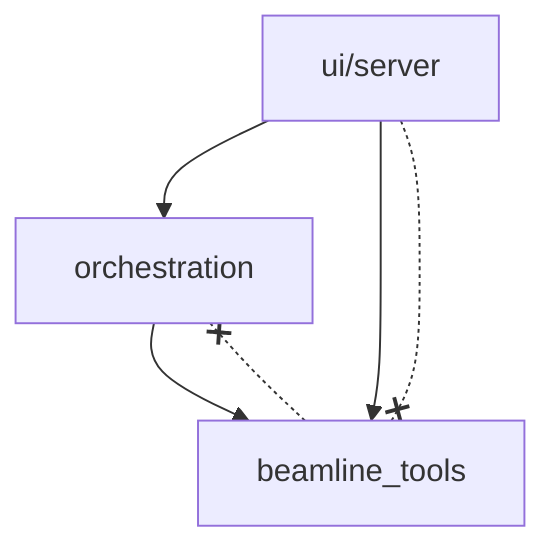
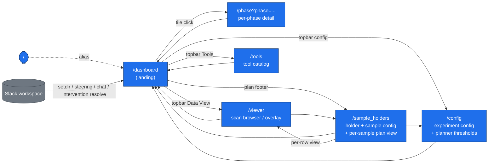

# Dependency Graph

Generated by walking the module structure. Update this file when you add a new
module, page route, or major cross-package import.

## System overview

```
                     Operator / Slack
                          |
                   +----- v -----+
                   |  FastAPI    |   ui/server/app.py
                   |  (port 5005)|   WebSocket + REST
                   +------+------+
                          |
          +---------------+---------------+
          |                               |
   orchestration/                  beamline_tools/
     api.py (lifespan)               spec_control/
     planner/ (tick, plan)            spec_cmd.py
     agents/ (spawn, runs)            transport (mock/tcp/screen)
     plan_store/ (DB CRUD)            tool_catalog/ (definitions + executor)
     chat/ (sessions, handler)        action_log/ (DB CRUD)
                                      spec_data/ (scan reader, plotting)
          |                               |
          +----------- agents -----------+
                   (claude -p subprocesses)
                   beamtimehero CLI (stdin/stdout)
```

## Package dependency direction

Arrows mean "imports from". No cycles exist between the three top-level
packages.



`beamline_tools` never imports `orchestration`. `ui/server` imports both but
only through the `orchestration.api` facade (plus tool catalog for `/api/tools`).

## Internal module map

### orchestration/

| Module | Depends on | Purpose |
|---|---|---|
| `api.py` | planner, plan_store, agents, chat, config, spec_cmd | FastAPI lifespan, orchestrator wiring, event emitter |
| `planner/orchestrator_tick.py` | agents, plan_store, agent/phase_runner | 3s polling loop: planner respawn, steering dispatch, STOP, heartbeat |
| `planner/planner.py` | plan_store/client, plan_store/session | Plan composition, budget tracking, all plan mutations (optimistic-locked) |
| `planner/phase.py` | plan_store/client, spec_cmd | Phase transition precondition checks + gating |
| `planner/loop.py` | plan_store | Orchestrator singleton (holds state, phase, checker) |
| `planner/staff_guidance.py` | plan_store/client | Intervention request + dual-path resolution (asyncio.Event + DB poll) |
| `agent/phase_runner.py` | agents/runs, plan_store/session, agents/spawn | Per-phase subprocess lifecycle (start/kill/status), log teeing |
| `agents/spawn.py` | agents/runs, agent/claude_code_client, config | Generic subprocess spawn + stream-json drain + MLflow logging |
| `agents/runs.py` | plan_store/session, plan_store/models | AgentRun CRUD (create, set_pid, complete, kill, list_active) |
| `plan_store/models.py` | (none) | SQLModel table definitions (18 tables) |
| `plan_store/session.py` | plan_store/models | Engine singleton, WAL pragmas, migrations, CRUD helpers |
| `plan_store/client.py` | plan_store/session, plan_store/models | Higher-level CRUD: plan upsert (with version), steering, transitions |
| `chat/handler.py` | agents/spawn, chat/sessions | ChatRouter: inbound routing, agent spawn, reply posting |
| `chat/sessions.py` | plan_store/session, plan_store/models | ChatSession + ChatMessage CRUD |
| `config.py` | (env vars) | PROJECT_ROOT, AGENT_BACKEND, OPENCODE_URL, defaults |
| `observability/mlflow_logging.py` | (mlflow) | Best-effort MLflow run context manager |

### beamline_tools/

| Module | Depends on | Purpose |
|---|---|---|
| `spec_control/spec_cmd.py` | action_log/db, transport, phases, config | Command dispatcher: allowlist, phase gate, action_log write, dispatch |
| `spec_control/transport.py` | (none) | DispatchResult, _MockScreen (in-memory SPEC simulator) |
| `spec_control/tcp_client.py` | transport | TCP socket transport to live SPEC |
| `spec_control/screen_client.py` | transport | GNU Screen transport (legacy) |
| `spec_control/sandbox_client.py` | transport | HTTP sandbox API transport |
| `spec_control/phases.py` | (none) | Phase vocabulary + agent-role motor/spec-write allowlists |
| `tool_catalog/executor.py` | spec_data, spec_logs, plotting | Tool dispatch: name → handler → JSON + images |
| `tool_catalog/autonomy_tools.py` | spec_cmd, plan_store (via CLI), spec_data | CAT-0..8 tool implementations (~50 tools) |
| `tool_catalog/autonomy_definitions.py` | (none) | Tool JSON schemas for MCP/OpenCode |
| `tool_catalog/definitions.py` | (none) | Base tool JSON schemas |
| `tool_catalog/cli.py` | definitions, autonomy_definitions | CLI tree generation (beamtimehero subcommands) |
| `tool_catalog/lineage.py` | definitions | Tool dependency tracking |
| `action_log/models.py` | (none) | ActionLog, QueryLog, CliInvocationLog (3 tables) |
| `action_log/db.py` | action_log/session, action_log/models | Action/query writers (commit-with-retry at start_action) |
| `action_log/session.py` | action_log/models | Engine singleton for beamline_tools.db |
| `spec_data/scans.py` | spec_data/spec_reader | Scan data access (read arrays, metadata) |
| `spec_data/plotting.py` | spec_data/scans | Matplotlib scan plots, statistics trends |

### ui/server/

| Module | Depends on | Purpose |
|---|---|---|
| `app.py` | orchestration.api, chat, routers/*, slack_bridge | FastAPI app creation, lifespan, WebSocket, page routes |
| `routers/dashboard_api.py` | plan_store/session | Experiment list, status snapshot, scan aggregates |
| `routers/phase_runner_api.py` | agent/phase_runner | Start/kill phases, run status, log tail |
| `routers/plan_api.py` | planner/planner | Plan CRUD, convergence stats, plan edits |
| `routers/orchestrator_api.py` | api, planner/loop | Orchestrator status, guidance submit, intervention resolve |
| `routers/config_api.py` | plan_store/session | Experiment/element/sample CRUD |
| `routers/sample_holders_api.py` | plan_store/session, planner | Holder + sample CRUD, plan rebuild on edit |
| `routers/agents_api.py` | agents/runs | List/kill agent runs |
| `routers/spec_log_api.py` | action_log/db | Action/query log history |
| `routers/viewer_api.py` | spec_data | Scan viewer data |
| `routers/tool_plots_api.py` | (filesystem) | Serve PNG plots from data/tool_plots/ |
| `routers/safety_switches_api.py` | (filesystem) | Safety switch state |
| `adapters/slack_bridge.py` | (slack_sdk) | Slack event routing: steering, chat, setdir, intervention |

## UI page & API dependency graph

### Page endpoints

| URL              | File                                  | How you reach it                                                                                  |
| ---------------- | ------------------------------------- | ------------------------------------------------------------------------------------------------- |
| `/`              | `dashboard/index.html` (alias)        | Default landing                                                                                   |
| `/dashboard`     | `dashboard/index.html`                | Topbar "Dashboard" link from every other page                                                     |
| `/phase`         | `dashboard/phase.html`                | Click any phase tile on the dashboard (`openPhaseDetail()` in `autonomy.js`)                      |
| `/config`        | `config/index.html`                   | Topbar config icon from dashboard / sample_holders                                                |
| `/sample_holders` | `sample_holders/index.html`          | Dashboard plan-footer link, viewer topbar link                                                    |
| `/viewer`        | `viewer/index.html`                   | Dashboard topbar "Data View" link, per-row "view" action in `sample_holders.js`                   |
| `/tools`         | `tools/index.html`                    | Dashboard topbar "Tools" (opens in new tab)                                                       |

> **Note on aliases:** `/` and `/dashboard` both serve `dashboard/index.html`.
> If `BASE_PATH` is set (deployment behind a prefix), every route above is
> served under that prefix.

### Navigation graph



### API routers

Every router is included in `ui/server/app.py:create_app`. Pages drive these
endpoints over `fetch()`; nothing else should be calling them directly.

| Prefix                  | File                              | Primary consumer page(s)                       |
| ----------------------- | --------------------------------- | ---------------------------------------------- |
| `/api/agents`           | `agents_api.py`                   | dashboard (agent panel)                         |
| `/api`                  | `config_api.py`                   | config, sample_holders (defaults + submit)      |
| `/api/dashboard`        | `dashboard_api.py`                | dashboard, phase                                |
| `/api/orchestrator`     | `orchestrator_api.py`             | dashboard (status, guidance, intervention)      |
| `/api/phase`            | `phase_runner_api.py`             | dashboard, phase                                |
| `/api/plan`             | `plan_api.py`                     | dashboard, config (thresholds), sample_holders (plan pills + regenerate) |
| `/api/safety_switches`  | `safety_switches_api.py`          | dashboard (autonomy bar)                        |
| `/api/sample_holders`   | `sample_holders_api.py`           | sample_holders, dashboard (holder updates via autonomy.js) |
| `/api/slack`            | `slack_status_api.py`             | Slack bridge / manual posts                     |
| `/api/spec_log`         | `spec_log_api.py`                 | dashboard (SPEC log tail)                       |
| `/api/tool_plots`       | `tool_plots_api.py`               | dashboard (agent plot panel)                    |
| `/api/viewer`           | `viewer_api.py`                   | viewer                                          |

Top-level endpoints registered directly in `app.py` (not in a router):

| URL              | Purpose                                       |
| ---------------- | --------------------------------------------- |
| `/health`        | Liveness + opencode/orchestrator status.       |
| `/api/chat`      | Inbound chat -> `ChatRouter.handle_inbound`.   |
| `/api/chat/clear`| Archive UI chat session, mint new id.          |
| `/api/tools`     | Tool catalog for `/tools`.                    |
| `/api/reset`     | `orch_api.reset_conversation()`.               |
| `/ws`            | WebSocket broadcast for live updates.          |
| `/static/*`      | Mounted from `ui/static/`.                    |

### Static asset bundles

`ui/static/` mounts at `/static`. Each page directory is its own bundle.
There is also a `shared/` directory and `favicon.ico`.

| Script                           | Included on                                   |
| -------------------------------- | --------------------------------------------- |
| `dashboard/static/dashboard.js`  | dashboard, phase, sample_holders, viewer      |
| `dashboard/autonomy.js`          | dashboard                                     |
| `config/form.js`                 | config, sample_holders (sample card + gather) |
| `shared/chat_widget.js`          | phase                                         |

## Databases

Two SQLite files, both using WAL mode + 5s busy_timeout:

| File | Package | Tables | Purpose |
|---|---|---|---|
| `data/orchestration.db` | orchestration/plan_store | 18 | Experiment config, plan, agents, steering, chat, audit |
| `data/beamline_tools.db` | beamline_tools/action_log | 3 | SPEC action log, query log, CLI invocation log |

Cross-DB references (soft, not FK-enforced): `ActionLog.experiment_id` and
`ActionLog.phase_run_id` point into `orchestration.db` by string ID.

## Agent subprocesses

Each phase agent is a `claude -p` subprocess launched by `phase_runner.start()`.
The agent communicates with the system exclusively through the `beamtimehero`
CLI, which routes to `tool_catalog/executor.py` in a child Python process.

```
FastAPI server (parent)
  |
  +-- orchestrator_tick (asyncio task, 3s poll)
  |
  +-- phase_runner.start("collection")
  |     |
  |     +-- Popen("scripts/data-collection-claude.sh")
  |           |   env: BEAMTIMEHERO_AGENT_RUN_ID, SPEC_PHASE_OVERRIDE
  |           |   stdin: stream-json seed prompt
  |           |   stdout: stream-json events -> log file
  |           |
  |           +-- claude -p --model opus --output-format stream-json
  |                 |
  |                 +-- Bash(beamtimehero spec-write run-xas ...)
  |                 +-- Bash(beamtimehero db update-plan ...)
  |                 +-- Bash(beamtimehero tool plot-scan ...)
  |
  +-- phase_runner.start("planner")
        +-- (same pattern)
```
