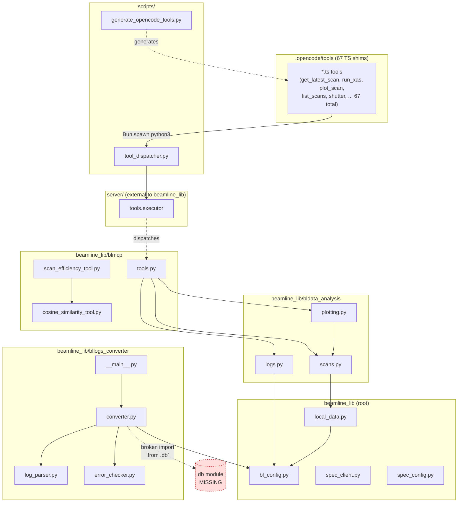

# Module Dependency Graph

Covers `.opencode/tools/` and `beamline_lib/`, plus the `scripts/` bridge between them.

The `.opencode/tools/*.ts` files are 67 identical shims (no cross-imports) that shell out to `scripts/tool_dispatcher.py`, which then pulls in `beamline_lib`. They're collapsed into a single node below.

## Key observations

- **Central choke point:** [bl_config.py](../beamline_lib/bl_config.py) is the only non-stdlib dep for [local_data.py](../beamline_lib/local_data.py), [bldata_analysis/logs.py](../beamline_lib/bldata_analysis/logs.py), and [bllogs_converter/converter.py](../beamline_lib/bllogs_converter/converter.py). Everything rolls through it for env-driven paths.
- **Analysis spine:** `blmcp/tools.py` → `bldata_analysis.{scans, logs, plotting}` → `local_data` → `bl_config`. That's the hot path for almost every scan/log tool.
- **Isolated leaves:** [spec_client.py](../beamline_lib/spec_client.py), [spec_config.py](../beamline_lib/spec_config.py), [blmcp/cosine_similarity_tool.py](../beamline_lib/blmcp/cosine_similarity_tool.py), and the two `bllogs_converter` parsers have no intra-package deps.
- **Broken import:** [bllogs_converter/converter.py:28](../beamline_lib/bllogs_converter/converter.py#L28) does `from .db import (...)` but there is no `db` submodule in `bllogs_converter/`. Running `python -m beamline_lib.bllogs_converter` would fail at import.
- **`.opencode/tools/`:** 67 autogenerated TS shims, no cross-imports. They're a flat fan-in to `tool_dispatcher.py`; generator is [scripts/generate_opencode_tools.py](../scripts/generate_opencode_tools.py).

## Raw import edges

Extracted via `grep -rE '^(from|import)' beamline_lib/`:

| Importer | Imports |
|---|---|
| `beamline_lib/local_data.py` | `bl_config` |
| `beamline_lib/bldata_analysis/scans.py` | `local_data` |
| `beamline_lib/bldata_analysis/plotting.py` | `. scans` |
| `beamline_lib/bldata_analysis/logs.py` | `bl_config` |
| `beamline_lib/blmcp/tools.py` | `bldata_analysis.{scans, logs, plotting}` |
| `beamline_lib/blmcp/scan_efficiency_tool.py` | `blmcp.cosine_similarity_tool` |
| `beamline_lib/bllogs_converter/__main__.py` | `.converter` |
| `beamline_lib/bllogs_converter/converter.py` | `bl_config`, `.db` *(missing)*, `.log_parser`, `.error_checker` |
