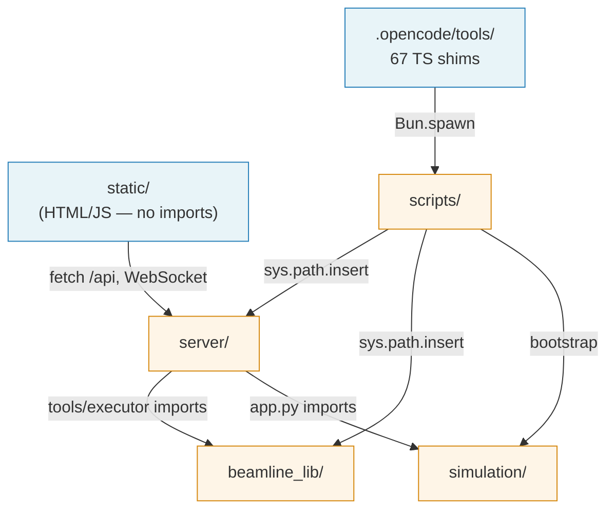
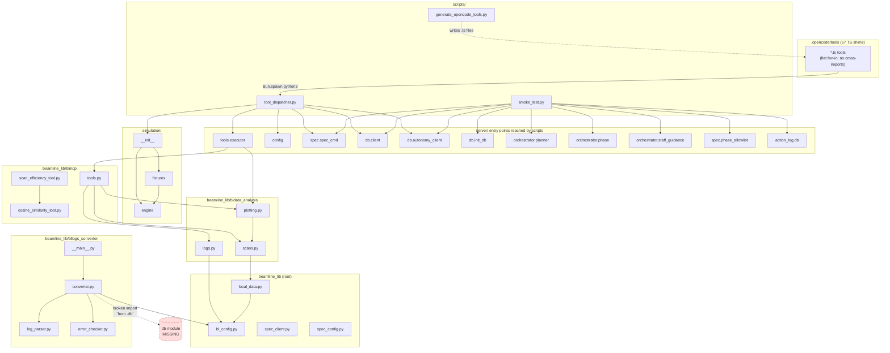

# Project-wide Dependency Graph

Whole-repo map — extends [dependency_graph.md](dependency_graph.md) (which covered only `beamline_lib` + `.opencode/tools`). Extracted by grepping `^(from|import) …` across all `.py` files and keeping only intra-project edges (stdlib and third-party dropped).

## 1. Package-level overview

## 2. `server/` internals

Full module graph for the FastAPI backend. Arrows are `from X import …` edges.

```mermaid
graph TD
    APP[app.py]

    subgraph api["ui/ — FastAPI routers"]
        CFGA[config_api]
        DASHA[dashboard_api]
        INSA[insight_api]
        ORCA[orchestrator_api]
        PLANA[plan_api]
        SAMPA[sample_holders_api]
        VIEWA[viewer_api]
    end

    subgraph orch["orchestrator/"]
        LOOP[loop]
        PLANNER[planner]
        PHASE[phase]
        STAFF[staff_guidance]
    end

    subgraph specpkg["spec/"]
        SCMD[spec_cmd]
        SCREEN[screen_client]
        PHALLOW[phase_allowlist]
    end

    subgraph dbpkg["db/"]
        DBC[client]
        DBA[autonomy_client]
        DBM[models]
        DBI[init_db]
    end

    subgraph tools["tools/"]
        TINIT[__init__]
        TEXEC[executor]
        TCLI[cli]
        TAUTO[autonomy_tools]
        TDEF[definitions]
        TADEF[autonomy_definitions]
        TLIN[lineage]
    end

    subgraph analysis["analysis/"]
        DECISIONS[decisions]
        FITTER[fitter]
        STRAT[scan_strategies]
    end

    subgraph actionlog["action_log/"]
        AL[db]
    end

    CFG[config.py]
    CFGEN[config_generator.py]
    OCC[opencode_client.py]
    CONV[conversation.py]
    SB[slack_bridge.py]
    SN[slack_notify.py]
    SR[spec_reader.py]
    REPORTS[reports.py]

    %% app.py fan-out
    APP --> CFG
    APP --> OCC
    APP --> CONV
    APP --> SB
    APP --> DBI
    APP --> LOOP
    APP --> STAFF
    APP --> SCMD
    APP --> TAUTO
    APP --> CFGA
    APP --> DASHA
    APP --> INSA
    APP --> ORCA
    APP --> PLANA
    APP --> SAMPA
    APP --> VIEWA

    %% ui → core
    CFGA --> CFG
    CFGA --> CFGEN
    CFGA --> DBC
    CFGA --> DBM
    DASHA --> AL
    DASHA --> DBA
    DASHA --> DBC
    DASHA --> DBM
    DASHA --> SCMD
    INSA --> CFG
    ORCA --> CFG
    ORCA --> DBA
    ORCA --> DBC
    ORCA --> OCC
    ORCA --> PLANNER
    ORCA --> LOOP
    ORCA --> STAFF
    ORCA --> SCMD
    PLANA --> DBA
    PLANA --> DBC
    PLANA --> PLANNER
    PLANA --> SCMD
    SAMPA --> CFGEN
    SAMPA --> DBC
    SAMPA --> DBM
    SAMPA --> PLANNER
    VIEWA --> DBC
    VIEWA --> DBM

    %% orchestrator internals
    LOOP --> CFG
    LOOP --> CONV
    LOOP --> DBA
    LOOP --> PLANNER
    LOOP --> PHASE
    LOOP --> STAFF
    LOOP --> PHALLOW
    LOOP --> SCMD
    PLANNER --> CFG
    PLANNER --> DBA
    PLANNER --> DBC
    PLANNER --> DBM
    PHASE --> DBA
    PHASE --> PHALLOW
    PHASE --> SCMD
    STAFF --> DBA

    %% spec internals
    SCMD --> AL
    SCMD --> PHALLOW
    SCMD --> SCREEN
    SCREEN --> CFG

    %% db internals
    DBA --> DBC
    DBA --> DBM
    DBC --> DBM
    DBI --> DBM

    %% action_log
    AL --> DBC
    AL --> DBM

    %% tools
    TINIT --> TDEF
    TINIT --> TADEF
    TINIT --> TEXEC
    TCLI --> TEXEC
    TAUTO --> AL
    TAUTO --> DBA
    TAUTO --> PLANNER
    TAUTO --> STAFF
    TAUTO --> PHALLOW
    TAUTO --> SCMD
    TEXEC -.->|crosses to beamline_lib| BLEXT((blmcp /<br/>bldata_analysis))

    %% analysis
    DECISIONS --> FITTER
    DECISIONS --> STRAT

    %% misc core
    CONV --> OCC
    OCC --> CFG
    SB --> CFG
    CFGEN --> DBC
    CFGEN --> DBM
    REPORTS --> SR

    classDef crossref fill:#fff3e0,stroke:#e67e22,stroke-dasharray:3 3
    class BLEXT crossref
```

## 3. `beamline_lib/` + `.opencode/tools` + `scripts/` bridge

(Same shape as [dependency_graph.md](dependency_graph.md), with the `server/` crossings made explicit.)

## 4. Key observations

### Architecture

- **`app.py` is the single composition root.** It imports every `ui/*` router, the orchestrator, the Slack bridge, the opencode client, the db bootstrap, and the simulation module. Everything else is reachable from there.
- **Three hubs absorb most incoming edges:** [config.py](../server/config.py) (env/paths), [db/client.py](../server/db/client.py) + [db/autonomy_client.py](../server/db/autonomy_client.py) (persistence), and [spec/spec_cmd.py](../server/spec/spec_cmd.py) (hardware gateway). Touching any of these ripples widely.
- **`ui/` routers never talk to each other.** Each router composes db + orchestrator + spec independently — good isolation, easy to add a new router.
- **Single bridge to `beamline_lib`.** Only [tools/executor.py](../server/tools/executor.py) imports `blmcp`/`bldata_analysis`. Everything analysis-flavored goes through that one file, so `beamline_lib` stays swappable.
- **Only crossing into `simulation/` is [app.py](../server/app.py) and [scripts/tool_dispatcher.py](../scripts/tool_dispatcher.py).** Well-contained.

### Dead / suspicious code

- **Broken import** in [bllogs_converter/converter.py:28](../beamline_lib/bllogs_converter/converter.py#L28): `from .db import (...)` — there is no `db` submodule in `bllogs_converter/`. Running `python -m beamline_lib.bllogs_converter` fails at import time.
- **[server/tools/lineage.py](../server/tools/lineage.py)** is new and currently has no incoming imports from the rest of the tree (untracked in `git status`).
- **[beamline_lib/spec_client.py](../beamline_lib/spec_client.py)** and **[beamline_lib/spec_config.py](../beamline_lib/spec_config.py)** have no intra-project importers. Likely legacy — the active SPEC bridge is [server/spec/spec_cmd.py](../server/spec/spec_cmd.py) + [server/spec/screen_client.py](../server/spec/screen_client.py).
- **[server/reports.py](../server/reports.py)** imports [server/spec_reader.py](../server/spec_reader.py) but nothing imports `reports.py` itself in the current tree.

### Cross-layer facts worth remembering

- **Subprocess re-entry.** Every `.opencode/tools/*.ts` spawns a fresh Python process via [scripts/tool_dispatcher.py](../scripts/tool_dispatcher.py); parent env vars don't reach it, so `tool_dispatcher.py` re-bootstraps `simulation` and reloads the active phase from the db each call.
- **Autogenerated.** The 67 `.ts` shims under [.opencode/tools/](../.opencode/tools/) are produced by [scripts/generate_opencode_tools.py](../scripts/generate_opencode_tools.py) from `tools.TOOL_DEFINITIONS` — never hand-edit them.
- **No intra-frontend edges.** [static/](../static/) is plain HTML/JS; it talks to the backend only via HTTP + WebSocket, so it doesn't appear in the module graph beyond the single edge in §1.

## 5. Raw edge list (for scripted consumption)

Extracted via `grep -rE '^(from|import)' server/ simulation/ scripts/ beamline_lib/` and filtered to intra-project imports.

| From | To |
|---|---|
| `server/app.py` | `config`, `simulation`, `opencode_client`, `conversation`, `slack_bridge`, `db.init_db`, `orchestrator.loop`, `orchestrator.staff_guidance`, `spec.spec_cmd`, `tools.autonomy_tools`, `ui.*` |
| `server/opencode_client.py` | `config` |
| `server/conversation.py` | `opencode_client` |
| `server/slack_bridge.py` | `config` |
| `server/config_generator.py` | `db.client`, `db.models` |
| `server/reports.py` | `spec_reader` |
| `server/tools/__init__.py` | `tools.definitions`, `tools.autonomy_definitions`, `tools.executor` |
| `server/tools/executor.py` | `blmcp.tools`, `bldata_analysis.plotting` |
| `server/tools/cli.py` | `tools.executor` |
| `server/tools/autonomy_tools.py` | `action_log.db`, `db.autonomy_client`, `orchestrator.planner`, `orchestrator.staff_guidance`, `spec.phase_allowlist`, `spec.spec_cmd` |
| `server/orchestrator/loop.py` | `config`, `conversation`, `db.autonomy_client`, `orchestrator.planner`, `orchestrator.phase`, `orchestrator.staff_guidance`, `spec.phase_allowlist`, `spec.spec_cmd` |
| `server/orchestrator/planner.py` | `config`, `db.autonomy_client`, `db.client`, `db.models` |
| `server/orchestrator/phase.py` | `db.autonomy_client`, `spec.phase_allowlist`, `spec.spec_cmd` |
| `server/orchestrator/staff_guidance.py` | `db.autonomy_client` |
| `server/spec/spec_cmd.py` | `action_log.db`, `spec.phase_allowlist`, `spec.screen_client` |
| `server/spec/screen_client.py` | `config` |
| `server/db/client.py` | `db.models` |
| `server/db/autonomy_client.py` | `db.client`, `db.models` |
| `server/db/init_db.py` | `db.models` |
| `server/action_log/db.py` | `db.client`, `db.models` |
| `server/analysis/decisions.py` | `.fitter`, `.scan_strategies` |
| `server/ui/config_api.py` | `config`, `config_generator`, `db.client`, `db.models` |
| `server/ui/dashboard_api.py` | `action_log.db`, `db.autonomy_client`, `db.client`, `db.models`, `spec.spec_cmd` |
| `server/ui/insight_api.py` | `config` |
| `server/ui/orchestrator_api.py` | `config`, `db.autonomy_client`, `db.client`, `opencode_client`, `orchestrator.{planner,loop,staff_guidance}`, `spec.spec_cmd` |
| `server/ui/plan_api.py` | `db.autonomy_client`, `db.client`, `orchestrator.planner`, `spec.spec_cmd` |
| `server/ui/sample_holders_api.py` | `config_generator`, `db.client`, `db.models`, `orchestrator.planner` |
| `server/ui/viewer_api.py` | `db.client`, `db.models` |
| `simulation/__init__.py` | `.engine`, `.fixtures` |
| `simulation/fixtures.py` | `.engine` |
| `scripts/tool_dispatcher.py` | `simulation`, `config`, `spec.spec_cmd`, `db.client`, `db.autonomy_client`, `tools.executor` |
| `scripts/generate_opencode_tools.py` | `tools.TOOL_DEFINITIONS` |
| `scripts/smoke_test.py` | `db.init_db`, `db.client`, `db.autonomy_client`, `orchestrator.{planner,phase,staff_guidance}`, `spec.{phase_allowlist,spec_cmd}`, `action_log.db` |
| `beamline_lib/local_data.py` | `bl_config` |
| `beamline_lib/bldata_analysis/scans.py` | `local_data` |
| `beamline_lib/bldata_analysis/plotting.py` | `.scans` |
| `beamline_lib/bldata_analysis/logs.py` | `bl_config` |
| `beamline_lib/blmcp/tools.py` | `bldata_analysis.{scans,logs,plotting}` |
| `beamline_lib/blmcp/scan_efficiency_tool.py` | `blmcp.cosine_similarity_tool` |
| `beamline_lib/bllogs_converter/__main__.py` | `.converter` |
| `beamline_lib/bllogs_converter/converter.py` | `bl_config`, `.db` *(MISSING)*, `.log_parser`, `.error_checker` |
